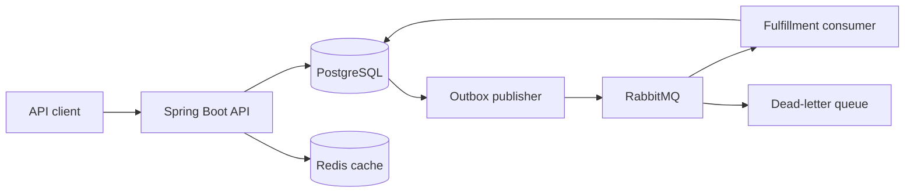

# FulfillFlow

FulfillFlow is a backend-focused warehouse order fulfillment platform. It reserves inventory without overselling, turns orders into asynchronous fulfillment work, and tracks each item through picking, completion, cancellation, or expiration.

## Why this project exists

Fulfillment systems must remain correct when workers act concurrently and infrastructure fails. FulfillFlow demonstrates those backend concerns directly:

- PostgreSQL row locks and transactions protect inventory invariants.
- Idempotency keys prevent duplicate reservations during client retries.
- A transactional outbox prevents committed order events from being lost.
- RabbitMQ retries failed work and routes exhausted messages to a dead-letter queue.
- Redis caches frequently read catalog data.
- Expired reservations release abandoned stock automatically.
- JWT authentication separates administrator and fulfillment-worker permissions.

## Architecture



An order and its inventory reservations commit in one database transaction. The same transaction writes an outbox event. A scheduled publisher delivers that event to RabbitMQ, where an idempotent consumer creates the fulfillment task.

## Technology

- Java 21, Spring Boot 4, Spring Security, Spring Data JPA
- PostgreSQL, Flyway, Redis, RabbitMQ
- JWT, BCrypt, OpenAPI/Swagger, Actuator, Prometheus
- JUnit, MockMvc, H2, Maven, Docker, GitHub Actions

## Run locally

Prerequisites: Java 21 and Docker.

```bash
cp .env.example .env
docker compose up -d
./mvnw spring-boot:run
```

On Windows, use `Copy-Item .env.example .env` and `mvnw.cmd spring-boot:run`. Export the values from `.env` in your shell; Spring does not load that file automatically.

Required secrets:

- `JWT_SECRET`: at least 32 random characters
- `ADMIN_EMAIL`: initial administrator email
- `ADMIN_PASSWORD`: initial administrator password

Set `DEMO_DATA_ENABLED=true` to create three portfolio products and orders on startup. The seed is idempotent, so restarts do not add duplicates.

The bootstrap administrator is created only when the configured email does not already exist.

## Useful URLs

| Service | URL |
| --- | --- |
| API | `http://localhost:8080` |
| Swagger UI | `http://localhost:8080/swagger-ui.html` |
| OpenAPI JSON | `http://localhost:8080/v3/api-docs` |
| Health | `http://localhost:8080/actuator/health` |
| Prometheus metrics | `http://localhost:8080/actuator/prometheus` |
| RabbitMQ management | `http://localhost:15672` |

RabbitMQ uses `fulfillflow` as both the username and password in the local Compose environment.

## Authentication

Request a one-hour access token:

```bash
curl -X POST http://localhost:8080/api/auth/login \
  -H "Content-Type: application/json" \
  -d '{"email":"admin@example.com","password":"your-password"}'
```

Send the returned token as `Authorization: Bearer <token>`.

- Administrators manage products, inventory, and user accounts.
- Workers and administrators manage orders and fulfillment work.
- Catalog and inventory reads are public.

## Main endpoints

| Method | Path | Purpose |
| --- | --- | --- |
| `POST` | `/api/auth/login` | Issue an access token |
| `POST` | `/api/users` | Create a worker or administrator |
| `POST` | `/api/products` | Create a product and its inventory record |
| `PATCH` | `/api/inventory/{productId}` | Adjust stock on hand |
| `POST` | `/api/inventory/{productId}/reservations` | Reserve stock idempotently |
| `POST` | `/api/orders` | Create an atomic multi-item order |
| `POST` | `/api/orders/{id}/start` | Begin picking |
| `POST` | `/api/orders/{orderId}/items/{itemId}/pick` | Consume picked stock |
| `POST` | `/api/orders/{orderId}/items/{itemId}/unavailable` | Release unavailable stock |
| `POST` | `/api/orders/{id}/complete` | Complete resolved order |
| `DELETE` | `/api/orders/{id}` | Cancel order and release reservations |
| `GET` | `/api/fulfillment-tasks` | List asynchronous work |

The reservation endpoint requires an `Idempotency-Key` header.

## Verification

```bash
./mvnw verify
docker build -t fulfillflow .
```

The test suite covers migrations, validation, duplicate requests, stock invariants, transaction rollback, picking transitions, cancellation, caching, reservation expiration, event-consumer idempotency, JWT login, and role authorization. GitHub Actions runs the suite and builds the production image for every pull request.

## Deployment

`render.yaml` defines a Docker-based Render web service. Provision reachable PostgreSQL, RabbitMQ, and Redis instances, then set the environment variables listed in `.env.example`. Flyway applies all schema migrations when the application starts.

Free Render services can sleep when idle and are suitable for portfolio demonstrations, not production traffic.
